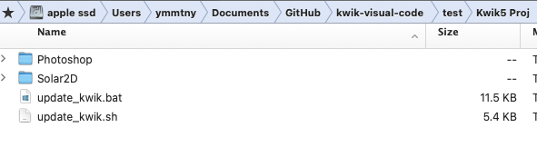

# kwik5-project-template


- Step 1: Install the Kwik exporter
- Step 2: Set up the Kwik exporter with your project folder
  - (Optional) Step 2-1: Use the update_kwik script for setup
- Step 3: Run the Solar2D simulator with the code published by the Kwik exporter

## Step 1 – Install the Photoshop UXP Plugin (.ccx)

You can download the Kwik exporter plugin for Photoshop from the releases page of this repository:

  - https://github.com/kwiksher/kwik5-project-template/releases/latest/download/com.kwiksher.kwik5.exporter_PS.ccx

    - Download the `.ccx` file and double-click it to install.
    - The Creative Cloud app will open and prompt you to install—click the install button.

      

      Click "Yes" if prompted.

      

      Open Photoshop.

      

### Project Structure

The Kwik exporter uses the same codebase as this repository. When you create a new project from the settings tab in the exporter, it creates `Photoshop` and `Solar2D` folders inside your chosen directory.

  - BookServer (Work In Progress)
  - **Photoshop** > book
    - landscape.psd
    - portrait.psd

      

  - Scripts (Work In Progress)

  - **Solar2D**/main.lua

    Open this file in the Solar2D Simulator.

    - `kwikEditorLandscape.lua`: This file is created by `update_kwik.sh` or can be copied manually to `~/Library/Application Support/Corona/Simulator/Skins`.

  - UXP/kwik-exporter

    The GitHub Action "Create Release" packs the files into `com.kwiksher.kwik5.exporter_PS.ccx`.

## Step 2 – Using the Kwik Exporter in Photoshop

Open the exporter from `Plugins > Kwik Exporter` in Photoshop. The exporter needs to know:

  1. Your project root directory (e.g., `~/Documents/GitHub/kwik5-project-template/`)
  2. The `Photoshop/{book}` folder containing your `.psd` files
  3. The `Solar2D/App/{book}` folder where images and Lua files will be published

  

1. Go to the Settings tab

    In "New Project," set your project name and book name.

    

    - Click "Create" > "New Kwik Project"

      

      Use the "Browse" button to select your destination folder, then click "Export" to create the new project.

   - Open your project folder in Finder (Mac) or File Explorer (Windows)

      

      The first time, click "Show Folder" to reveal the folder.

      

      

      ### (Optional) update_kwik Script

        Your project includes `update_kwik.sh` (Mac) and `update_kwik.bat` (Windows). These scripts run automatically if `lua_modules/kwiksher/kwik` is missing when the simulator starts. You can also run them manually.

        

        #### Windows

        When running `update_kwik.bat`, you'll be asked if you want to install the Solar2D protocol handler. This experimental feature lets you open the Solar2D simulator with a `solar2d://` URL.

        ```
        Do you want to install the Solar2D protocol handler? (y/n):
        ```

        - `solar2d.reg` sets the URL scheme. Choose **Yes** to enable the protocol.

        

        

        [Solar2D URL scheme](https://github.com/kwiksher/kwik5-project-template/blob/main/Scripts/readme.md)

        You can enter a URL like this in your browser on Windows:

      ```
      solar2d://open?url=file://C:/Users/ymmtny/Documents/Solar2D/kwik-visual-code/develop/Solar2D/kwik5-project-template/Solar2D/main.lua&skin=KwikEditorLandscape
      ```

      > You can also create a web page that uses the Solar2D URL scheme to launch the simulator directly from your browser.

###

1. Go to the Menu tab – Photoshop Files

    > The "Reset" checkbox changes the button state to "Open".

    - Use the "Open" button to select the folder containing your `.psd` files.

      

    - Click a PSD file name to open it.

      

    - Guide Layouts are created by Kwik_ATN actions, but you can use your own.

      

    - Settings Tab > Tools

      Safe area guidelines are also available.

      

1. Solar2D Project

    Select the `App/{book}` folder where the Kwik exporter will create images and Lua files.

    

### Publishing

1. Select the PSD files you want to publish. You can use the **all** checkbox, then click the "Publish" button. By default, only checked files will be published.

  

  1. Publish dialog

      

      Due to a known Photoshop UXP bug, you should check that image export works before using scripts to automate export. If it doesn't work, restart Photoshop.

      To check, just try exporting a PNG manually:

      - Select a layer, right-click, and choose "Quick Export as PNG". Once this works, you don't need to repeat the check.

        

      If export works, select "Publish" again and click **Continue** to publish the selected PSD files.

      Make sure to check the publish options and the App/book folder path.

      

      The Kwik exporter processes the PSD files and layers, and shows a dialog when finished.

      

 1. Load Simulator

    You can open the Solar2D simulator with the **Load Simulator** button.

    

    When prompted for permission, select "Allow".

    

    #### Windows

      The root folder opens in File Explorer; double-click **startStar2D.bat** to run the Solar2D simulator.

      > On Windows, the Kwik exporter (UXP extension) cannot open Solar2D.exe automatically.

      

    When the Solar2D Simulator opens, use Window > View As to change the skin to Kwik Editor Landscape or Portrait.

    

---

 ### Active Document


  - **Validate Name & Opacity**

    Japanese katakana is converted to alphabet.

    Opacity zero is adjusted because Photoshop does not export transparent layers as PNG.

  - **Export Code**

    Only exports Lua files.

  - **Skip scenes:** Useful if you open a PSD file not in the list of Photoshop files.

      If unchecked, the scenes (pages) index is always updated with the list of Photoshop files (default behavior).

  - **Export Images**

    - (Optional) Hold the Shift key

      Only exports the single selected layer when using **Export images** in Active Document.

    - Layer names starting with "-" (hyphen) are ignored when exporting code & images.

 ### Layer Groups


  - **Unmerge**

    Select a layer group in the Layer panel to export each child layer individually.

  - **Cancel**

    Cancel Unmerge.

  - **Refresh**

    If there is a subfolder with the same name as the layer group in App/book/assets/images/page, Unmerge is triggered. You can manually create subfolders and use the Refresh button.

---

For more details, see the [online documentation (WIP)](https://kwiksher.github.io/kwik5docs/get_started/index.html).

---

## Step 3 – Solar2D Simulator > main.lua

For development, set `main.lua` to development mode and `config.lua` to adaptive. For production (device build), switch to production mode and set `config.lua` to letterbox. In production, you don't need the Kwik editor, so don't use development mode.

### config.lua

For the final device build, change the scale to `"letterbox"`:

scale = "adaptive" to "letterbox"

```lua
application = {
  content =
  {
    fps = 60,
    width = 320,
    height = 480,
    -- scale = "adaptive",
    scale = "letterbox",
    xAlign = "center",
    yAlign = "center",
```

### main.lua

Change `env.mode = "development"` to `"production"`.

> Production mode does not load the Kwik editor.

Edit `env.props` to update the book and page names to match your project.

> If the Kwik editor gives an error, try setting `env.restore = true` to recover with .bak files. Set it back to false after recovery.

By default in development, `turnOffNativeVideo` is set to `true` (videos won't play). Set it to `false` to enable video playback.

```lua
local env = require("env")
env.book   = "book"
env.goPage = "landscape"
env.lang   = ""
--
env.restore = false
--
env.mode = "development"
-- env.mode = "production"
-- env.mode = "debug" -- need kwik5-plugin src from kwiksher's repo

--
if env.mode == "development" or env.mode == "debug" then
  env.props = {
    name = env.book,
    editor = true,
    gotoPage = env.goPage,
    language = env.lang, -- empty string "" is for a single language project
    position = {x = 0, y = 0},
    gotoLastBook = false,
    unitTest = false,
    httpServer = false,
    showPageName = true,
    turnOffNativeVideo = true
  }
elseif env.mode == "production" then
  env.props = {
    name = env.book,
    editor = false,
    gotoPage = env.goPage,
    language = env.lang, -- empty string "" is for a single language project
    position = {x = 0, y = 0},
    gotoLastBook = false,
    unitTest = false,
    httpServer = false,
    showPageName = false,
    turnOffNativeVideo = false
  }
end
--
--
system.setTapDelay(0.2)
--
--
if env.setPlugin(env.mode)  then
  local kwik = require("kwiksher.kwik")
  --
  --display.setDefault( "background", 0.2, 0.2, 0.2, 0.1 )
  kwik.useGradientBackground()
  --

  if env.restore and  kwik.restore() then
    native.showAlert("kwik", "restored comment it out kwik.restore()")
    return
  end

  kwik.setCustomModule(
    "custom",
    {
      commands = {"myEvent"},
      components = {
        -- "align",
        "myComponent",
        "thumbnailNavigation",
        "index"
        -- "keyboardNavigation",
      }
    }
  )
  --
  kwik.bootstrap(env.props)
  --
end
```

---

### Update Kwik modules

`update_kwik.sh` (Mac) and `update_kwik.bat` (Windows) fetch the latest release and overwrite the `lua_modules` folder in Solar2D.


- https://github.com/kwiksher/kwik5-project-template/releases


you may check the current version by

- Mac

  ```
  bash ./update_kwik.sh --version
  ```

- Win

  ```
  ./update_kwik.bat --version
  ```

Without --version arg, it will fetch the latest version and set it to `./lua_modules/kwiksher`.
