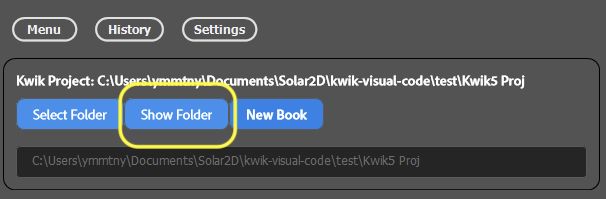
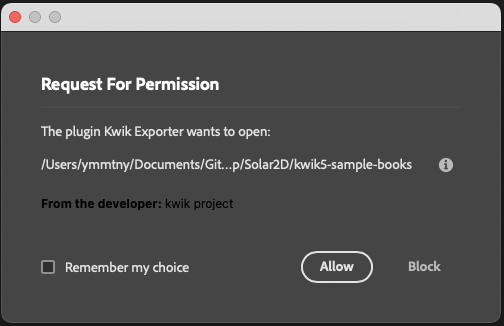
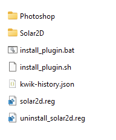
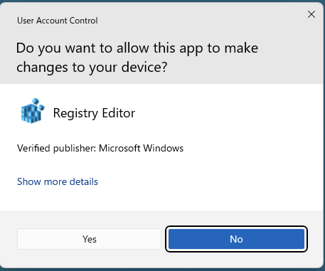
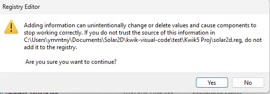
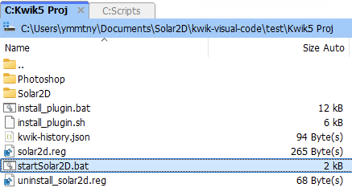

# kwik5-project-template

- step1 install kwik exporter
- step2 setup kwik exporter with your project folder
  - step2-1 setup with install_plugin script
- step3 Solar2D simulator with published codes from kwik exporter

## Step1 - Photoshop UXP .ccx

In the release of this repository, you can download the kwik expoert ccx for Photoshop.

  - https://github.com/kwiksher/kwik5-project-template/releases/latest/download/com.kwiksher.kwik5.exporter_PS.ccx


    - download the ccx and double click it to install it.

    - Creative Cloud app opens and shows the dialog, click install button

      

      click yes

      

      open photoshop

      


### Source files of kwik5-project-template

kwik exporter contains the same codebase of this repository, when you create a new project from settings tab in kwik exporter, it creates Photoshop and Solar2D folder below to your specified folder in your PC.

  - BookServer (Work In Progress)
  - **Photoshop** > book
    - landscape.psd
    - portrait.psd

      

  - Scripts(Work In Progress)

  - **Solar2D**/main.lua

     open it Solar2D Simulator

      - kwikEditorLandscape.lua: this file should be created by install_plugin.sh or you can manually copy it to ~/Library/Application Support/Corona/Simulator/Skins folder

   - UXP/kwik-exporter

      gh action: Create Release, pack the files into com.kwiksher.kwik5.exporter_PS.ccx

## Step2 - Photoshop kwik-exporter

  Plugins > Kwik Exporter to open it. Kwik Exporter needs to know where is a photoshop file,  where is Solar2D/App/book folder and where Kwik Exporter publishes images and lua files of a psd file.

  1. Select **your project root directory for your project like ~/Documents/GitHub/kwik5-project-template/**

  1. Select **Photoshop/{book}** folder which contains .psd files

  1. Select **Solar2D/App/{book}** folder where kwik exporter publishes of images/lua files from .psd files


  You can open kwik expoert from Plugins > Kwik Exporter in Photoshop menu

  


1. Go Settings Tab

    In New Project, you can set your project name and book name.

    

    - Create button > New Kwik Project

      

      Browse button to select your destincation folder, and Export button to make a new project

   - Open your project folder in Finder(mac) or File Explore(win)

      

      For the first time, clicking Show Folder button shows

      

      

      ### Step2-1 Insall Solar2D modules
        In the created kwik5 Proj, you find install_plugin.sh(mac), install_plugin.bat(win).

        

        #### Windows

        when the install plugin bat is running, you are asked to install solar2d protocol or not. This is an experimental featrue that Solar2D simulator can be opened with solar2d://

        ```
        Do you want to install the Solar2D protocol handler? (y/n):
        ```

        - solar2d.reg will set the url scheme, select **Yes** to set the solar2d protocol

        

        

        [Solar2D URL scheme](https://github.com/kwiksher/kwik5-project-template/blob/main/Scripts/readme.md)

       you can enter the url like below in the browser in Windows
      ```
      solar2d://open?url=file://C:/Users/ymmtny/Documents/Solar2D/kwik-visual-code/develop/Solar2D/kwik5-project-template/Solar2D/main.lua&skin=KwikEditorLandscape
      ```


###

1. Go Menu Tab - Photoshop Files

    > Reset check box will change the button state to Open

    - Open button to select a folder where .psd files exist

      

    - You can click the name of psd file to open

      

    - Guide Layout is created by Kwik_ATN actions. You may use your own guide layout

      

    - Settings Tab > Tools

      guide lines for safe area are available too

      

1. Solar2D Project

    select App/{book} folder where kwik exporter creates images and lua files

    


### Publish

1. select the psd files to be published. you may use the **all** checkbox, then click Publish button. The psd files with check marks will be published as default.

  

  1. Publish dialog

      

      Because of the well-knonw bug of Photoshop UXP, you need to check export images works before using the script to automate the export tasks. If not work, you need to restart Photoshop.

      The check process is that simply try an export png manually.

      - Select a layer and then righ click Quick Export as PNG. Once done, you don't need to repeat this check again.

        

      OK, if you have checked it works, then select Publish again, then ckick **Continue** for publishing the selected psd files by Kwik Exporter.


      Make sure the checkboxes for publsih options, and the App/book folder path.

      

      Kwik expoerter traverses the psf files and the layers, and it shows the dialog at the end

      

 1. Load Simulator

    you can open Solar2D simulator with **Load Simulator** button.

    

    the request for permission dialog appears, select Allow.

    

    #### Windows

      the root folder is opened in File explorer, double click **startStar2D.bat** to run Solar2D simulator

      > Kwik exporter(UXP extension) in Windows can not open Solar2D.exe automatically

      


    When Solar2D Simulator opens, Window > View As to change the skin for Kwik Editor Landscape or portrait skin.

    

---

 ### Active Document


  - Validate Name & Opacity

    Japanese katakana is converted to alphabet

    Opacity zero is adjusted because Photoshop does not export transparent layer as png

  - Export Code

    only exports lua files

  - Skip scenes: this is useful if you open a psd file not in the list of Photoshop files.

      Unchked, the scenes(pages) index is always updated with the list of Photoshop files. This is default behavior.

  - Export Images

    - (option) press shift key

      it only exports one single layer selected while **Export images** in Active Document

    - layer names with starting "-" (hyphen) are ignored when exporting code & images

 ### Layer Groups


  - Unmerge

    select a layer group in Layer panel, and you can specify exportting each child

  - Cancel

    cancel Unmerge

  - Refresh

    if there is a sub folder as same name as layer group in App/book/assets/images/page, then Unmerge is triggered. So you can manually create sub folders there, such case you can use Refresh button

---

See more detail information in the online document(WIP)

- https://kwiksher.github.io/kwik5docs/get_started/index.html

---

## Step3 - Solar2D Simulator > main.lua

For development,you set main.lua in develoment mode and config.lua with adaptive, and for device build as production, you need to switch the mode to production and the config.lua with letterbox. For prodction, you don't need kwik editor, so don't use the developmenet mode.

### config.lua

for the final build for device, you need to change the scale as "letterbox"

scale = "adaptive" to "letterbox"

```lua
application = {
	content =
	{
		fps = 60,
		width = 320,
		height = 480,
		-- scale = "adaptive",
		scale = "letterbox",
		xAlign = "center",
		yAlign = "center",
```

### main.lua

env.mode = "developmenet" to "production"

> production mode does not load kwik editor

please edit in vscode to change the book and the page name tos your book and page name.

> if kwik editor makes an error, you may try env.restore = true which tries to recover with .bak files. Set it back to false again after the recover execution.

```lua
local env = require("env")
env.book   = "book"
env.goPage = "landscape"
env.lang   = ""
--
env.restore = false
--
env.mode = "development"
-- env.mode = "production"
-- env.mode = "debug" -- need kwik5-plugin src from kwiksher's repo

--
if env.mode == "development" or env.mode == "debug" then
  env.props = {
    name = env.book,
    editor = true,
    gotoPage = env.goPage,
    language = env.lang, -- empty string "" is for a single language project
    position = {x = 0, y = 0},
    gotoLastBook = false,
    unitTest = false,
    httpServer = false,
    showPageName = true,
    turnOffNativeVideo = true
  }
elseif env.mode == "production" then
  env.props = {
    name = env.book,
    editor = false,
    gotoPage = env.goPage,
    language = env.lang, -- empty string "" is for a single language project
    position = {x = 0, y = 0},
    gotoLastBook = false,
    unitTest = false,
    httpServer = false,
    showPageName = false,
    turnOffNativeVideo = false
  }
end
--
--
system.setTapDelay(0.2)
--
--
if env.setPlugin(env.mode)  then
  local kwik = require("kwiksher.kwik")
  --
  --display.setDefault( "background", 0.2, 0.2, 0.2, 0.1 )
  kwik.useGradientBackground()
  --

  if env.restore and  kwik.restore() then
    native.showAlert("kwik", "restored comment it out kwik.restore()")
    return
  end

  kwik.setCustomModule(
    "custom",
    {
      commands = {"myEvent"},
      components = {
        -- "align",
        "myComponent",
        "thumbnailNavigation",
        "index"
        -- "keyboardNavigation",
      }
    }
  )
  --
  kwik.bootstrap(env.props)
  --
end
```

### Upate kwik modules

install_plugin.sh (mac) , install_plugin.bat will fetch the latest release and overwrite the lua_moduels folder in Solar2D


