# kwik5-project-template

- Solar2D plugin kwik

  このリポジトリのinstall_plugin.shを使用して取得できます。スクリプトはプラグインを~/Library/Application Support/Corona/Simulator/Plugins/plugin/フォルダにインストールします。

    ```
    source ./install_plugin.sh
    ```

  または手動でダウンロードします。

  - https://github.com/kwiksher/kwik5-project-template/releases/latest/download/plugin.data.tgz

    ~/Library/Application Support/Corona/Simulator/Plugins/plugin/にコピーします。

      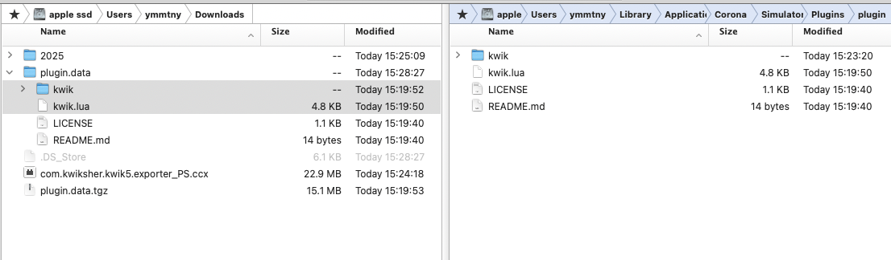

- Photoshop UXP

  - https://github.com/kwiksher/kwik5-project-template/releases/latest/download/com.kwiksher.kwik5.exporter_PS.ccx

    - 上記のccx ファイルをダウンロードしてダブルクリックしてインストールします。

    - Creative Cloud アプリが開き、ダイアログが表示されるので、インストールボタンをクリックします。

      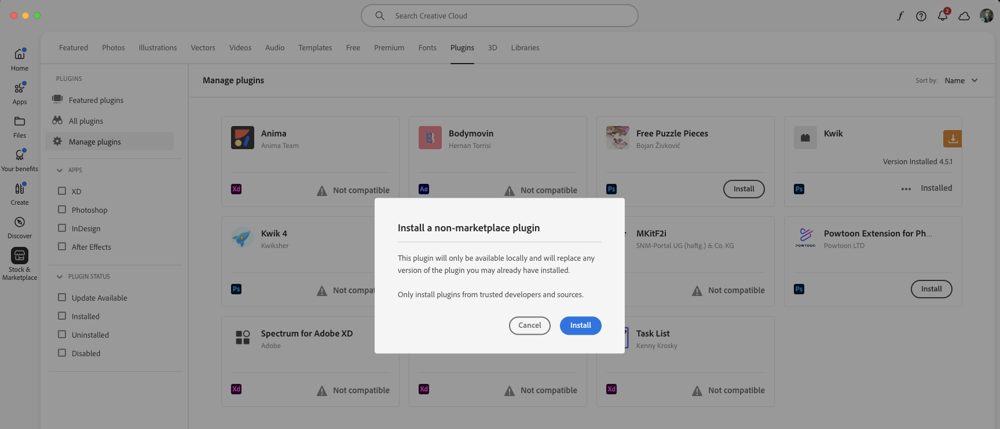

      「はい」をクリックします。

      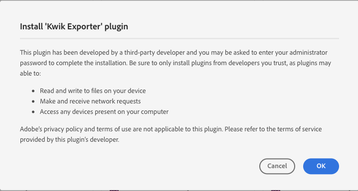

      Photoshopを開きます。

      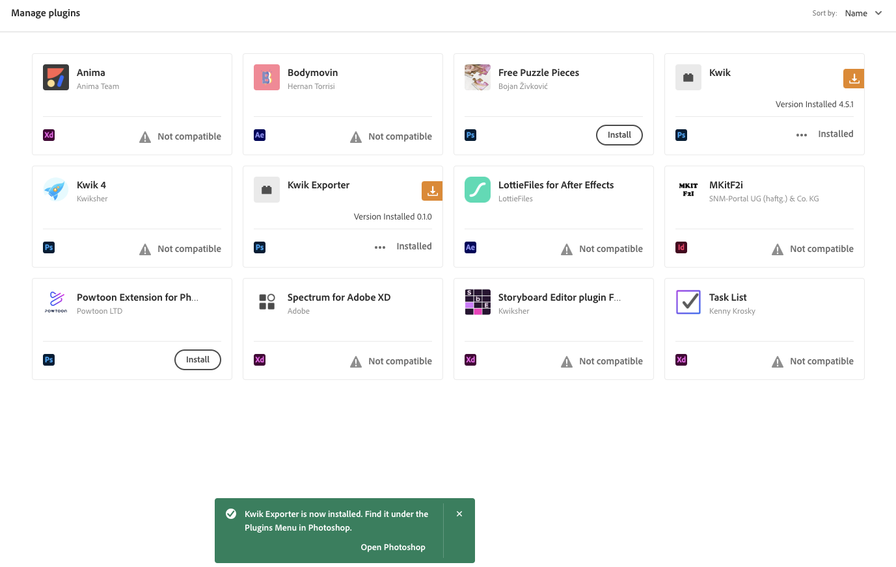

- kwik5-project-template

   Photoshop > book
    - landscape.psd
    - portrait.psd

      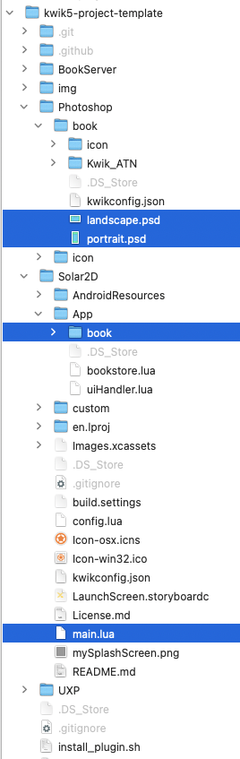

   - Solar2D/main.lua

      ⭐️ Solar2D Simulatorで開きます。

   - install_plugin.sh

   - UXP/kwik-exporter

       com.kwiksher.kwik5.exporter_PS.ccxをクリックする代わりに、Adobe UXP Developer Toolsを使用してkwik-exporterを開くことができます。

## Photoshop kwik-exporter

  プラグイン > Kwik Exporter を選択して開きます。Kwik ExporterはPhotoshopファイルがどこにあるか、またPSDファイルの画像とluaファイルをKwik Exporterが公開するSolar2D/App/bookフォルダがどこにあるかを知る必要があります。

  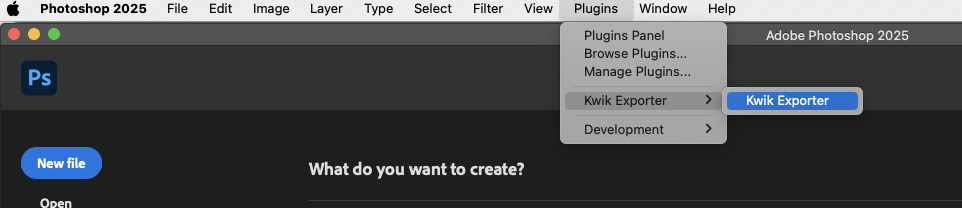

  1. **kwik5-project-template**フォルダを選択します。

    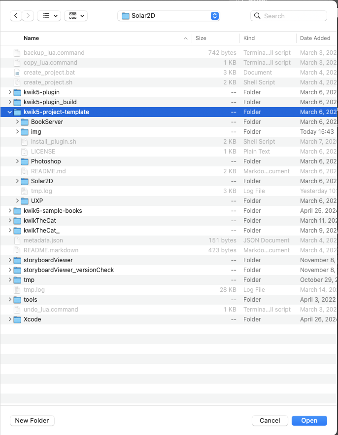

  2. **Photoshop**フォルダを選択します。

  3. **Solar2D/App/book**フォルダを選択します。

  リセットチェックボックスを選択し、開くをクリックして新しいフォルダを参照することで、これらの設定を変更できます。

  - ルートプロジェクトフォルダを変更するための設定タブ

    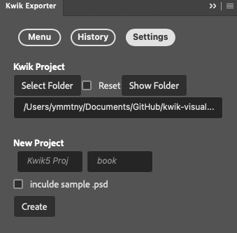

  - PhotoshopとSolar2Dのメニュータブ

    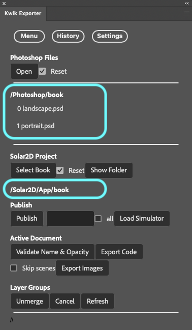

  ### psdファイルを開く

  psdファイルの名前をクリックして開くことができます。

  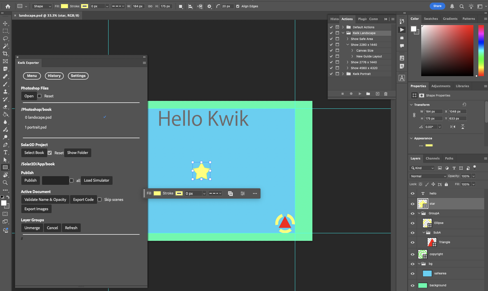

  - ガイドレイアウトはKwik_ATNアクションによって作成されます。独自のガイドレイアウトを使用できます。

    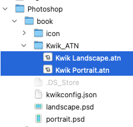

  ### Publish

  1. 公開するpsdファイルを選択します。**すべて**チェックボックスを使用し、公開ボタンをクリックできます。

      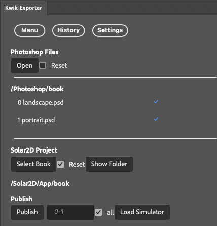

  2. 公開ダイアログが表示されます。

      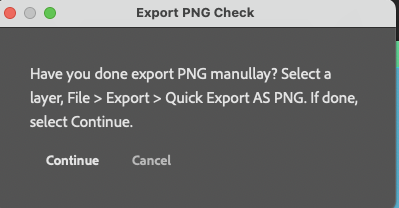

      Photoshop UXPの既知のバグのため、エクスポートタスクを自動化するためにスクリプトを使用する前に、画像のエクスポートが機能することを確認する必要があります。機能しない場合は、Photoshopを再起動する必要があります。

      チェックプロセスは、単純に手動でpngをエクスポートしてみることです。

      - レイヤーを選択し、右クリックしてPNGとしてクイックエクスポートします。完了したら、このチェックを再度繰り返す必要はありません。

        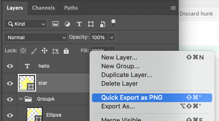

      OK、動作することを確認したら、再度公開を選択し、**続行**をクリックして、Kwik Exporterによって選択されたpsdファイルを公開します。

      公開オプションとApp/bookフォルダパスのチェックボックスを確認してください。

      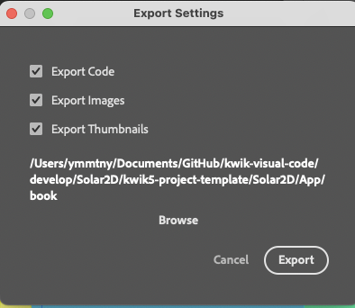

      Kwik Exporterはpsdファイルとレイヤーをトラバースし、最後にダイアログを表示します。

      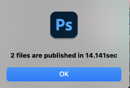

 3. Load Simulator

    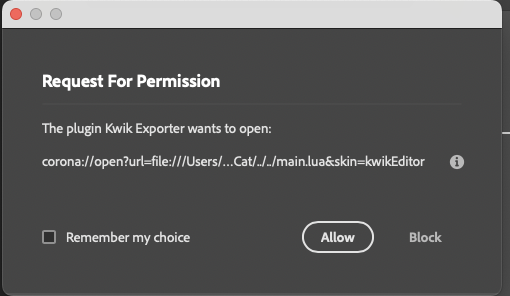

    install_plugin.shによってインストールされたKwik Edito Landscapeが選択されています。

    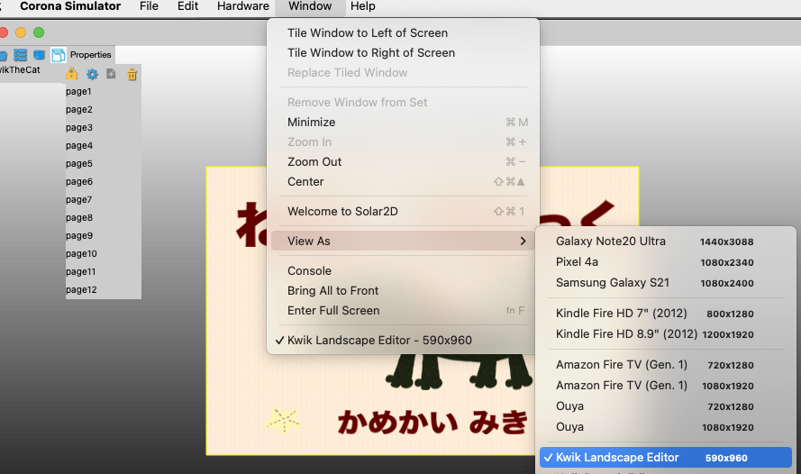

 ### Active Document

  - Validate Name & Opacity: 名前と不透明度の検証

    日本語カタカナはアルファベットに変換されます。

    Photoshopは透明なレイヤーをpngとしてエクスポートしないため、不透明度ゼロは調整されます。

  - Export Code: コードのエクスポート

    luaファイルのみをエクスポートします。

  - Skip scenes: シーンをスキップします。これは、Photoshopファイルのリストにないpsdファイルを開く場合に便利です。

      チェックを外すと、シーン（ページ）インデックスは常にPhotoshopファイルのリストで更新されます。これがデフォルトの動作です。

  - Export Images: 画像のエクスポート

    - {option) shiftキーを押した場合は、選択したレイヤーのみが出力されます。

      アクティブドキュメントで**画像のエクスポート**を選択している間、選択した単一のレイヤーのみをエクスポートします。

    - 先頭に"-"（ハイフン）が付いたレイヤー名は、コードと画像をエクスポートするときに無視されます。

    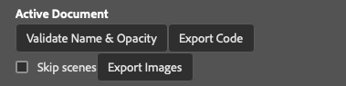

 ### Layer Groups
  - Unmerge マージ解除

    レイヤーパネルでレイヤーグループを選択すると、各子をエクスポートするように指定できます。

  - Cancel

    マージ解除をキャンセルします。

  - Refresh

    App/book/assets/images/pageにレイヤーグループと同じ名前のサブフォルダがある場合、マージ解除がトリガーされます。したがって、そこにサブフォルダを手動で作成できます。そのような場合は、更新ボタンを使用できます。

    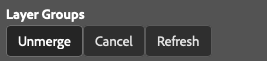

---

オンラインドキュメントで詳細情報を参照してください。

- https://kwiksher.github.io/kwik5docs/get_started/index.html

---

## Solar2D/main.lua

mode変数を「editing」または「production」のいずれかに設定してください。

> 「production」は、plugin.kwikがSolar2D公式プラグインに登録されていないため、Solar2Dフォルダにプラグインフォルダを作成します。自動的に統合されません。

> 「production」から「editing」