# kwik5-project-template

- step1 kwik exporterのインストール
- step2 プロジェクトフォルダでkwik exporterをセットアップ
- step3 kwik exporterからパブリッシュされたコードでSolar2Dシミュレータを実行

## Step1 - Photoshop UXP .ccx

このリポジトリのリリースから、Photoshop用のkwik exporter ccxをダウンロードできます。

  - https://github.com/kwiksher/kwik5-project-template/releases/latest/download/com.kwiksher.kwik5.exporter_PS.ccx


    - ccxをダウンロードし、ダブルクリックしてインストールします。

    - Creative Cloudアプリが開き、ダイアログが表示されたら、インストールボタンをクリックします。

      

      はいをクリック

      

      photoshopを開く

      


### kwik5-project-templateのソースファイル

kwik exporterにはこのリポジトリと同じコードベースが含まれており、kwik exporterの設定タブから新しいプロジェクトを作成すると、PCの指定したフォルダの下にPhotoshopとSolar2Dフォルダが作成されます。

  - BookServer (作業中)
  - **Photoshop** > book
    - landscape.psd
    - portrait.psd

      

  - Scripts(作業中)

  - **Solar2D**/main.lua

     Solar2Dシミュレータで開きます

      - kwikEditorLandscape.lua: このファイルはinstall_plugin.shによって作成されるか、手動で~/Library/Application Support/Corona/Simulator/Skinsフォルダにコピーできます。

   - UXP/kwik-exporter

      gh action: Create Release, ファイルをcom.kwiksher.kwik5.exporter_PS.ccxにパックします。

## Step2 - Photoshop kwik-exporter

  プラグイン > Kwik Exporterで開きます。Kwik Exporterは、photoshopファイルの場所、Solar2D/App/bookフォルダの場所、そしてKwik Exporterがpsdファイルの画像とluaファイルをどこにパブリッシュするかを知る必要があります。

  1. **~/Documents/GitHub/kwik5-project-template/のようなプロジェクトのルートディレクトリを選択します**

  1. .psdファイルを含む**Photoshop/{book}**フォルダを選択します

  1. kwik exporterが.psdファイルから画像/luaファイルをパブリッシュする**Solar2D/App/{book}**フォルダを選択します


  Photoshopメニューのプラグイン > Kwik Exporterからkwik exporterを開くことができます。

  


1. 設定タブに移動

    New Projectで、プロジェクト名とブック名を設定できます。

    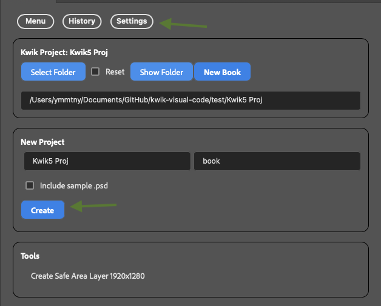

    - 作成ボタン > New Kwik Project

      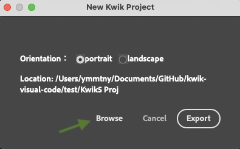

   - Exportでプロジェクトを作成

      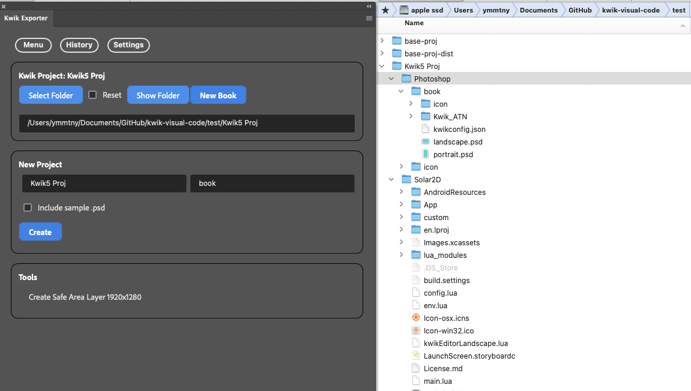


1. メニュータブに移動 - Photoshop Files

    > Resetチェックボックスはボタンの状態をOpenに変更します

    - Openボタンで.psdファイルが存在するフォルダを選択

      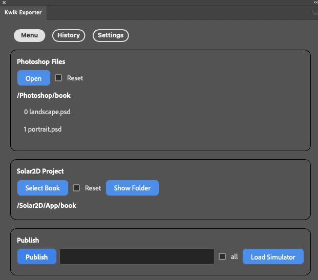

    - psdファイルの名前をクリックして開くことができます

      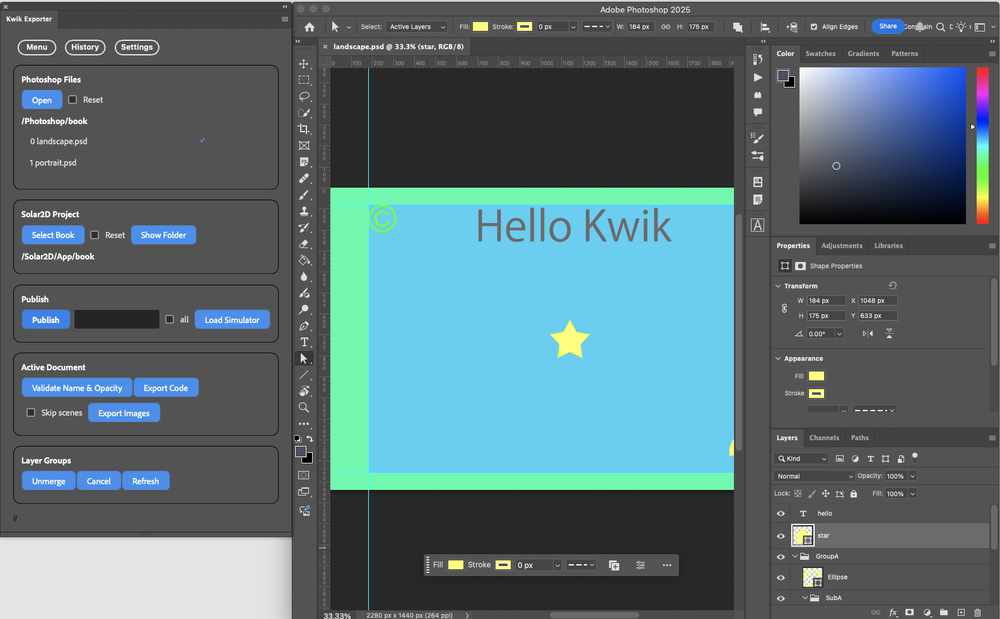

    - ガイドレイアウトはKwik_ATNアクションによって作成されます。独自のガイドレイアウトを使用することもできます

      

    - 設定タブ > ツール

      セーフエリア用のガイドラインも利用可能です

      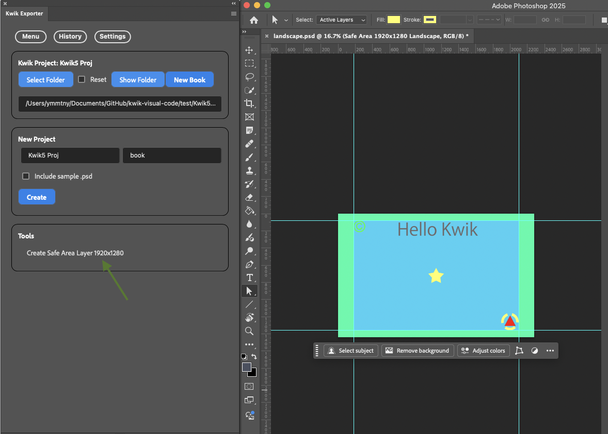

1. Solar2Dプロジェクト

    kwik exporterが画像とluaファイルを作成するApp/{book}フォルダを選択します

    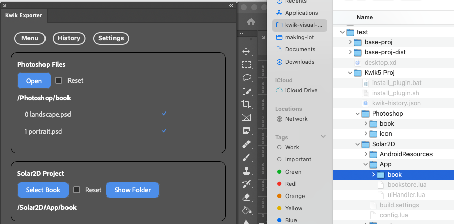


### パブリッシュ

1. パブリッシュするpsdファイルを選択します。**all**チェックボックスを使用できます。その後、Publishボタンをクリックします。チェックマークの付いたpsdファイルがデフォルトでパブリッシュされます。

  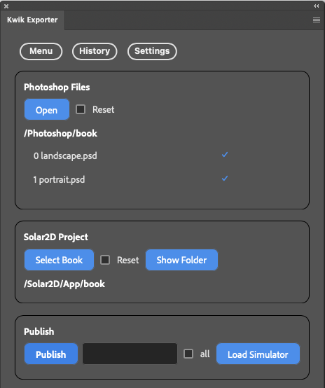

  1. パブリッシュダイアログ

      

      Photoshop UXPの既知のバグのため、エクスポートタスクを自動化するスクリプトを使用する前に、画像のエクスポートが機能することを確認する必要があります。機能しない場合は、Photoshopを再起動する必要があります。

      確認プロセスは、単に手動でpngをエクスポートしてみることです。

      - レイヤーを選択し、右クリックしてPNGとしてクイック書き出しを選択します。一度完了すれば、この確認を再度繰り返す必要はありません。

        

      OK、動作することを確認したら、再度Publishを選択し、**Continue**をクリックして、Kwik Exporterによって選択されたpsdファイルをパブリッシュします。


      パブリッシュオプションのチェックボックスと、App/bookフォルダのパスを確認してください。

      

      Kwik exporterはpsdファイルとレイヤーを走査し、最後にダイアログを表示します。

      

 1. シミュレータをロード

    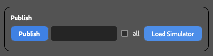


    


    update_kwik.shによってインストールされたKwik Editor Landscapeが選択されています。

    

 ### アクティブドキュメント

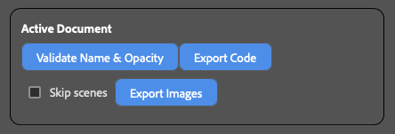

  - 名前と不透明度の検証

    日本語のカタカナはアルファベットに変換されます

    不透明度ゼロは、Photoshopが透明なレイヤーをpngとしてエクスポートしないため調整されます

  - コードのエクスポート

    luaファイルのみをエクスポートします

  - シーンをスキップ: これは、Photoshopファイルのリストにないpsdファイルを開く場合に便利です。

      チェックを外すと、シーン（ページ）のインデックスは常にPhotoshopファイルのリストで更新されます。これがデフォルトの動作です。

  - 画像のエクスポート

    - （オプション）shiftキーを押す

      アクティブドキュメントの**Export images**中に選択された単一のレイヤーのみをエクスポートします

    - "-"（ハイフン）で始まるレイヤー名は、コードと画像のエクスポート時に無視されます

 ### レイヤーグループ

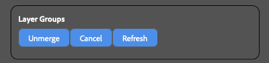

  - 非マージ

    レイヤーパネルでレイヤーグループを選択し、各子をエクスポートするように指定できます

  - キャンセル

    非マージをキャンセルします

  - 更新

    App/book/assets/images/pageにレイヤーグループと同じ名前のサブフォルダがある場合、非マージがトリガーされます。そのため、手動でサブフォルダを作成することができます。そのような場合は、更新ボタンを使用できます。

---

詳細については、オンラインドキュメント（WIP）を参照してください。

- https://kwiksher.github.io/kwik5docs/get_started/index.html

---

## Step3 - Solar2D Simulator > main.lua

開発中は、main.luaを開発モードに設定し、config.luaをadaptiveに設定します。デバイスビルド用の本番環境では、モードをproductionに切り替え、config.luaをletterboxに設定する必要があります。本番環境ではkwik editorは不要なので、開発モードは使用しないでください。

### config.lua

デバイス用の最終ビルドでは、scaleを "letterbox" に変更する必要があります。

scale = "adaptive" を "letterbox" に変更

```lua
application = {
	content =
	{
		fps = 60,
		width = 320,
		height = 480,
		-- scale = "adaptive",
		scale = "letterbox",
		xAlign = "center",
		yAlign = "center",
```

### main.lua

env.mode = "development" を "production" に変更

> productionモードではkwik editorはロードされません

vscodeで編集して、ブックとページ名をあなたのブックとページ名に変更してください。

> kwik editorがエラーを出す場合は、env.restore = trueを試してみてください。これは.bakファイルで回復を試みます。回復実行後は、再びfalseに戻してください。

```lua
local env = require("env")
env.book   = "book"
env.goPage = "landscape"
env.lang   = ""
--
env.restore = false
--
env.mode = "development"
-- env.mode = "production"
-- env.mode = "debug" -- kwiksherのリポジトリからkwik5-pluginのsrcが必要です

--
if env.mode == "development" or env.mode == "debug" then
  env.props = {
    name = env.book,
    editor = true,
    gotoPage = env.goPage,
    language = env.lang, -- 空文字列 "" は単一言語プロジェクト用です
    position = {x = 0, y = 0},
    gotoLastBook = false,
    unitTest = false,
    httpServer = false,
    showPageName = true,
    turnOffNativeVideo = true
  }
elseif env.mode == "production" then
  env.props = {
    name = env.book,
    editor = false,
    gotoPage = env.goPage,
    language = env.lang, -- 空文字列 "" は単一言語プロジェクト用です
    position = {x = 0, y = 0},
    gotoLastBook = false,
    unitTest = false,
    httpServer = false,
    showPageName = false,
    turnOffNativeVideo = false
  }
end
--
--
system.setTapDelay(0.2)
--
--
if env.setPlugin(env.mode)  then
  local kwik = require("kwiksher.kwik")
  --
  --display.setDefault( "background", 0.2, 0.2, 0.2, 0.1 )
  kwik.useGradientBackground()
  --

  if env.restore and  kwik.restore() then
    native.showAlert("kwik", "restored comment it out kwik.restore()")
    return
  end

  kwik.setCustomModule(
    "custom",
    {
      commands = {"myEvent"},
      components = {
        -- "align",
        "myComponent",
        "thumbnailNavigation",
        "index"
        -- "keyboardNavigation",
      }
    }
  )
  --
  kwik.bootstrap(env.props)
  --
end
```

### kwikモジュールの更新

update_kwik.sh (mac)、update_kwik.batは最新のリリースを取得し、Solar2Dのlua_modulesフォルダを上書きします。

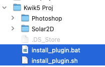
